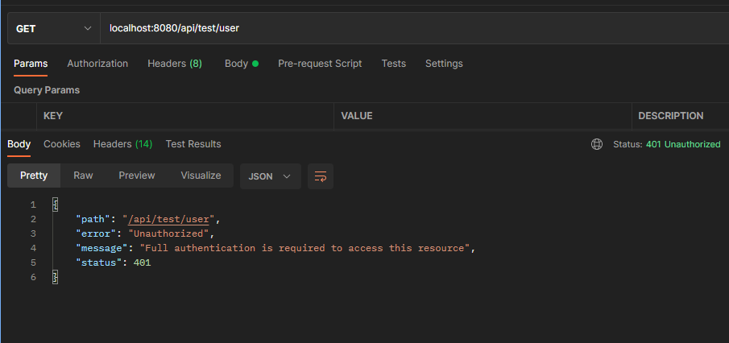

# Ljudio


#login/user part
1. You must implement these queries into your postgresSQL after running the project for the very first time:
## Run following SQL insert statements
```
INSERT INTO roles(name) VALUES('ROLE_USER');
INSERT INTO roles(name) VALUES('ROLE_ADMIN');
```


2. Then to go postMan and add the users you would like.


3. ####Select POST and localhost:8080/api/auth/signup


4. Now add the users using this body with raw text :

```
{
     "username" : "admin",
     "email" : "(email)",
     "password": "(password)",
     "role" : ["admin", "user"]
}
```

5. test the authentication to see if you are not allowed to go in to user or admin by using this pathway:
   ###/api/test/user or admin



6. you can also test sign in with api/auth/signin in postman with POST, because you send the user to authentication:

```
{
    "usrname" : "(usernmae)",
    "password" : "(password)"
}
```

you will get information on the user with token and all. Had left token in just so we can see the user token and information and points.


